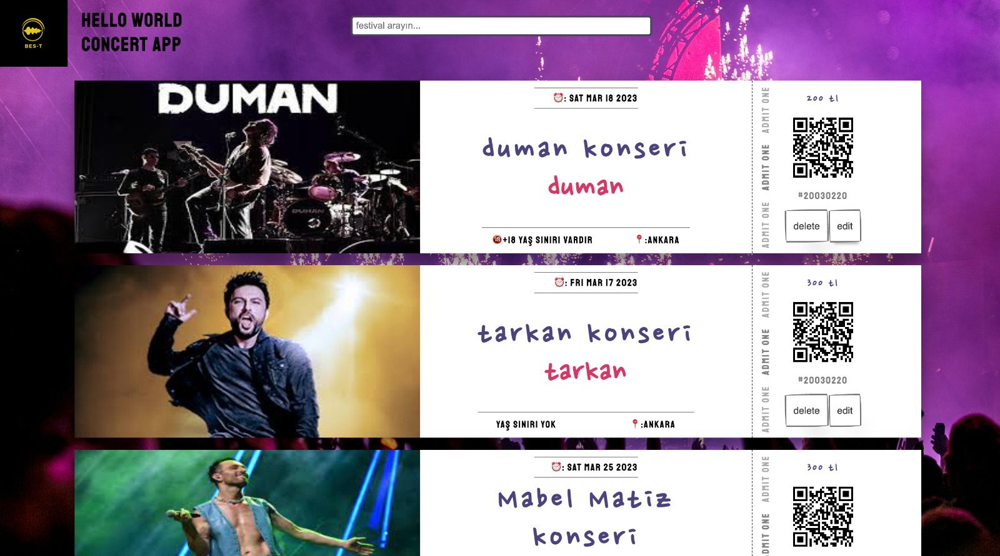
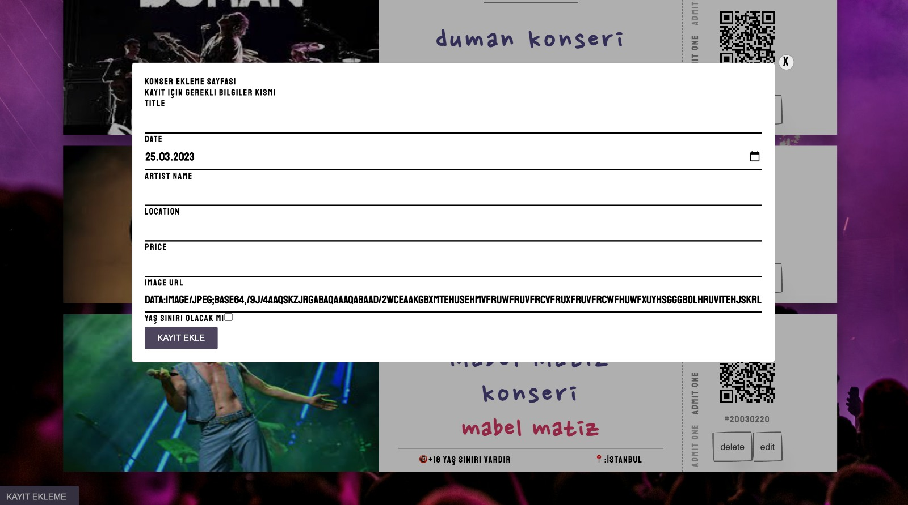
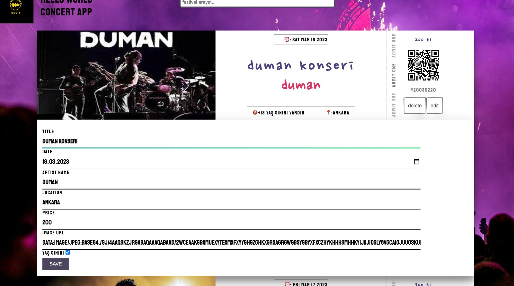
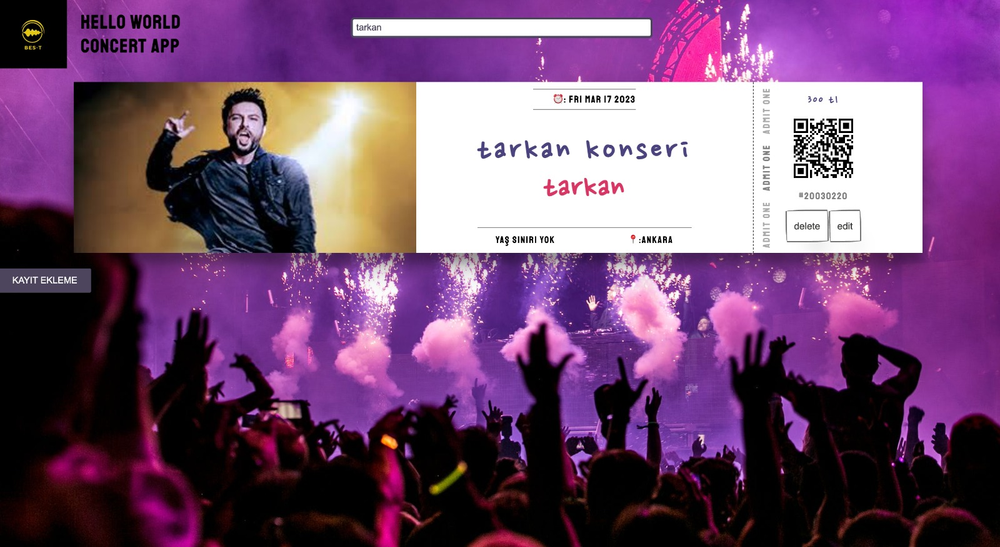

# Project:BES-T

##<ins>Visualisation of the website</ins>

- **Main Page Preview**

  

- **Create Ticket**

  

- **Edit Card Screen**

  

- **Searchbar**

  

##Description

> The main purpose of the project is to create a platform for creating, editing and deleting concert tickets. In addition, thanks to the searchbar in the project, we can easily find the concert we want.

##<ins>Technologies and Softwares used on the project</ins>

> - HTML
> - CSS
> - JavaScript
> - ReactJS

##<ins>Libraries Used</ins>

> - axios
> - fontawesome

###<ins>Created By</ins>

> - Fatma Seçil ÇAKIR
> - Bertan MORTAŞ
> - Enes DOĞANOĞLU
